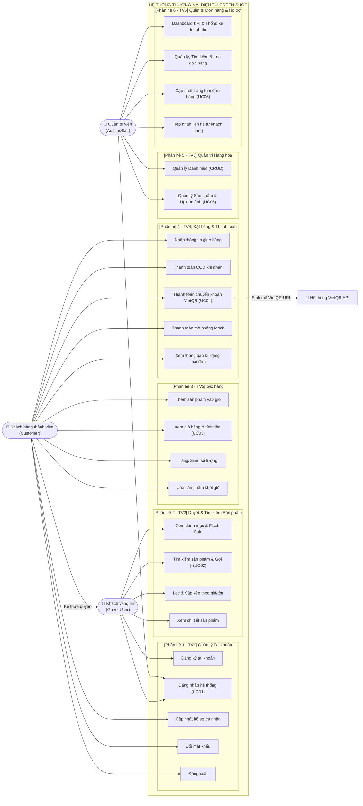
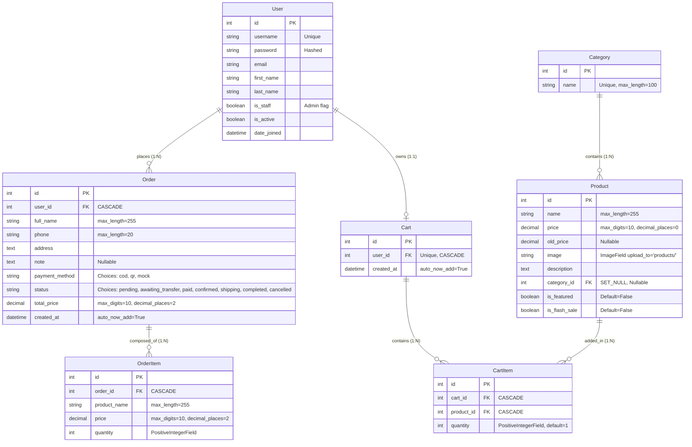

# TÀI LIỆU ĐẶC TẢ YÊU CẦU PHẦN MỀM (SRS)
## HỆ THỐNG THƯƠNG MẠI ĐIỆN TỬ SẢN PHẨM TIÊU DÙNG XANH (GREEN SHOP)

---

### THÔNG TIN TÀI LIỆU (DOCUMENT CONTROL)

| Mục | Nội dung |
| :--- | :--- |
| **Tên dự án** | Hệ thống Thương mại điện tử Green Shop |
| **Mã dự án** | KCPM_GREENSHOP_2026 |
| **Tên tài liệu** | Software Requirements Specification (SRS) |
| **Phiên bản** | 1.0 (Quy chuẩn phân công nhóm 6 thành viên) |
| **Ngày ban hành** | 07/10/2026 |
| **Trạng thái** | Chính thức (Approved) |
| **Tác giả / Nhóm thực hiện** | Nhóm Phát triển & Kiểm thử Phần mềm (KCPM - 6 Thành viên) |
| **Chuẩn áp dụng** | IEEE Std 830-1998 / ISO/IEC/IEEE 29148:2018 |

---

## MỤC LỤC

1. [CHƯƠNG 1: GIỚI THIỆU TỔNG QUAN (INTRODUCTION)](#chương-1-giới-thiệu-tổng-quan-introduction)
   - 1.1 Mục đích tài liệu
   - 1.2 Phạm vi hệ thống
   - 1.3 Đối tượng sử dụng và Phân cấp vai trò (Actors)
   - 1.4 Danh mục từ viết tắt và Thuật ngữ
   - 1.5 Môi trường vận hành và Ngăn xếp công nghệ
2. [CHƯƠNG 2: MÔ TẢ TỔNG THỂ HỆ THỐNG (OVERALL DESCRIPTION)](#chương-2-mô-tả-tổng-thể-hệ-thống-overall-description)
   - 2.1 Kiến trúc hệ thống phân tầng (MVT Architecture)
   - 2.2 Sơ đồ Use Case tổng thể (Overall Use Case Diagram)
   - 2.3 Phân rã 6 gói phân hệ nghiệp vụ cho nhóm 6 người
   - 2.4 Giả định và Sự phụ thuộc
3. [CHƯƠNG 3: DANH SÁCH YÊU CẦU CHỨC NĂNG (FUNCTIONAL REQUIREMENTS)](#chương-3-danh-sách-yêu-cầu-chức-năng-functional-requirements)
   - 3.1 FR1: Phân hệ Quản lý tài khoản (Thành viên 1)
   - 3.2 FR2: Phân hệ Duyệt và Tìm kiếm sản phẩm (Thành viên 2)
   - 3.3 FR3: Phân hệ Quản lý giỏ hàng (Thành viên 3)
   - 3.4 FR4: Phân hệ Đặt hàng và Thanh toán đa kênh (Thành viên 4)
   - 3.5 FR5: Phân hệ Quản trị Hàng hóa - Danh mục & Sản phẩm (Thành viên 5)
   - 3.6 FR6: Phân hệ Quản trị Đơn hàng, Doanh thu & Liên hệ (Thành viên 6)
   - 3.7 Bảng đặc tả API Endpoints (Phục vụ Kiểm thử Postman)
4. [CHƯƠNG 4: ĐẶC TẢ CHI TIẾT 6 USE CASE CHÍNH (DETAILED USE CASE SPECIFICATIONS)](#chương-4-đặc-tả-chi-tiết-6-use-case-chính-detailed-use-case-specifications)
   - 4.1 UC01: Đăng nhập & Xác thực vai trò (Thành viên 1)
   - 4.2 UC02: Tìm kiếm gợi ý tức thì & Lọc sản phẩm (Thành viên 2)
   - 4.3 UC03: Quản lý giỏ hàng & Tính toán (Thành viên 3)
   - 4.4 UC04: Đặt hàng & Thanh toán đa kênh VietQR/Mock/COD (Thành viên 4)
   - 4.5 UC05: Quản lý sản phẩm Admin - CRUD & Upload ảnh (Thành viên 5)
   - 4.6 UC06: Xử lý và Cập nhật trạng thái đơn hàng Admin (Thành viên 6)
5. [CHƯƠNG 5: YÊU CẦU PHI CHỨC NĂNG (NON-FUNCTIONAL REQUIREMENTS - NFR)](#chương-5-yêu-cầu-phi-chức-năng-non-functional-requirements---nfr)
   - 5.1 NFR1: Hiệu năng và Tải hệ thống
   - 5.2 NFR2: An toàn thông tin và Bảo mật
   - 5.3 NFR3: Tính khả dụng và Tin cậy
   - 5.4 NFR4: Tính tương thích và Trải nghiệm người dùng
   - 5.5 NFR5: Khả năng bảo trì và Mở rộng
6. [CHƯƠNG 6: THIẾT KẾ CƠ SỞ DỮ LIỆU & RÀNG BUỘC KỸ THUẬT (DATA SPECIFICATIONS)](#chương-6-thiết-kế-cơ-sở-dữ-liệu--ràng-buộc-kỹ-thuật-data-specifications)
   - 6.1 Sơ đồ thực thể liên kết (Entity Relationship Diagram - ERD)
   - 6.2 Từ điển dữ liệu chi tiết các bảng cốt lõi
7. [CHƯƠNG 7: MA TRẬN TRUY VẾT YÊU CẦU (REQUIREMENTS TRACEABILITY MATRIX - RTM)](#chương-7-ma-trận-truy-vết-yêu-cầu-requirements-traceability-matrix---rtm)

---

# CHƯƠNG 1: GIỚI THIỆU TỔNG QUAN (INTRODUCTION)

### 1.1 Mục đích tài liệu (Document Purpose)
Tài liệu Đặc tả Yêu cầu Phần mềm (Software Requirements Specification - SRS) này mô tả toàn diện, chi tiết và chính xác các yêu cầu chức năng, yêu cầu phi chức năng, quy tắc nghiệp vụ, giao diện tương tác và kiến trúc luồng dữ liệu của hệ thống **Green Shop - Website Thương mại điện tử phân phối sản phẩm tiêu dùng xanh**.

Tài liệu được thiết kế làm cơ sở chuẩn mực kỹ thuật cho:
- **Đội ngũ Phân tích nghiệp vụ (BA):** Xác lập ranh giới phạm vi và nghiệm thu chức năng.
- **Đội ngũ Lập trình (Developers):** Xây dựng Models, Views, Templates, API endpoints và logic xử lý giao dịch.
- **Đội ngũ Kiểm thử (QA/QC Testers - Nhóm 6 thành viên):** Xây dựng ma trận kiểm thử (Test Matrix), phân bổ kịch bản kiểm thử (Test Scenarios), thiết kế Test Cases hộp đen/hộp trắng, tạo Postman Collections và theo dõi lỗi trên Jira.
- **Giảng viên hướng dẫn:** Theo dõi tiến độ, đánh giá khối lượng công việc phân bổ minh bạch cho từng sinh viên trong nhóm.

### 1.2 Phạm vi hệ thống (System Scope)
Dự án **Green Shop** xây dựng nền tảng thương mại điện tử chuyên cung cấp sản phẩm xanh, thân thiện môi trường (thực phẩm hữu cơ, đồ dùng sinh học, sản phẩm tái chế).

**Phạm vi bao gồm:**
- Cổng mua sắm trực tuyến cho khách hàng cá nhân (B2C).
- Xem danh mục phân cấp, tìm kiếm tức thì theo từ khóa (live search gợi ý AJAX), lọc và sắp xếp đa tiêu chí, tính toán khuyến mãi tự động (Flash Sale, Nổi bật).
- Quản lý giỏ hàng trực tuyến theo phiên đăng nhập của người dùng.
- Quy trình Đặt hàng và Thanh toán đa phương thức:
  - Thanh toán khi nhận hàng (Cash on Delivery - COD).
  - Thanh toán chuyển khoản tự động quét mã QR ngân hàng chuẩn VietQR API.
  - Thanh toán trực tuyến mô phỏng cổng điện tử (Mock Online Payment Sandbox).
- Cổng quản trị độc lập (Admin Panel) với giao diện trực quan hỗ trợ thống kê KPI doanh thu, quản lý danh mục, sản phẩm, đơn hàng và xử lý liên hệ từ khách hàng.

**Phạm vi không bao gồm (Giới hạn đề tài học thuật):**
- Tích hợp cổng thanh toán quốc tế Visa/MasterCard thật (do giới hạn sandbox).
- Quản lý đa kho vận (Multi-warehouse) và phân hệ GPS theo dõi tài xế thời gian thực.

### 1.3 Đối tượng sử dụng và Phân cấp vai trò (Actors)

| Tác nhân (Actor) | Bản chất | Mô tả vai trò & Quyền hạn |
| :--- | :--- | :--- |
| **Khách vãng lai (Guest User)** | Con người | Người dùng truy cập website nhưng chưa đăng nhập. Có quyền duyệt danh sách sản phẩm, xem chi tiết, tìm kiếm bằng từ khóa, đăng ký tài khoản mới và đăng nhập. Khi ấn thêm giỏ hàng hoặc thanh toán, hệ thống yêu cầu đăng nhập. |
| **Khách hàng thành viên (Customer)** | Con người | Người dùng đã đăng nhập tài khoản (`is_authenticated = True`, `is_staff = False`). Có quyền quản lý hồ sơ cá nhân, đổi mật khẩu, thêm/sửa/xóa giỏ hàng, thực hiện checkout thanh toán và theo dõi lịch sử đơn hàng. |
| **Quản trị viên (Admin / Staff)** | Con người | Người quản trị hệ thống (`is_staff = True`). Toàn quyền truy cập phân hệ `admin_panel`: theo dõi Dashboard KPI doanh thu, quản lý danh mục (Category CRUD), quản lý sản phẩm (Product CRUD), quản lý đơn hàng và cập nhật trạng thái đơn hàng. |
| **Hệ thống ngoài (External Services)** | Hệ thống máy tính | Gồm dịch vụ sinh ảnh VietQR API (`img.vietqr.io`) tạo mã QR ngân hàng tự động kèm số tiền và nội dung chuyển khoản; hệ thống mô phỏng thanh toán trực tuyến Mock Payment Processor. |

### 1.4 Danh mục từ viết tắt và Thuật ngữ

| Thuật ngữ / Viết tắt | Tên đầy đủ | Định nghĩa / Diễn giải |
| :--- | :--- | :--- |
| **SRS** | Software Requirements Specification | Tài liệu đặc tả yêu cầu phần mềm |
| **FR** | Functional Requirement | Yêu cầu chức năng của hệ thống |
| **NFR** | Non-Functional Requirement | Yêu cầu phi chức năng (bảo mật, hiệu năng, độ tin cậy) |
| **UC** | Use Case | Ca sử dụng mô tả tương tác giữa Actor và Hệ thống |
| **MVT** | Model - View - Template | Mô hình kiến trúc phần mềm đặc trưng của Django framework |
| **COD** | Cash On Delivery | Phương thức thanh toán bằng tiền mặt khi nhận hàng |
| **VietQR** | Vietnam National QR Code | Chuẩn nhận diện mã QR thanh toán chuyển khoản liên ngân hàng Việt Nam |
| **RBAC** | Role-Based Access Control | Kiểm soát truy cập dựa trên vai trò người dùng |
| **CSRF** | Cross-Site Request Forgery | Cơ chế tấn công giả mạo yêu cầu trên trang web được Django bảo vệ bằng Token |
| **RTM** | Requirements Traceability Matrix | Ma trận truy vết yêu cầu phần mềm phục vụ kiểm thử |

### 1.5 Môi trường vận hành và Ngăn xếp công nghệ

- **Ngôn ngữ nền tảng:** Python 3.10+
- **Web Framework:** Django Framework (v5.x/6.x) & Django REST Framework
- **Hệ quản trị CSDL:** SQLite (Môi trường Dev/Test) / PostgreSQL (Môi trường Production)
- **Front-end UI:** HTML5, CSS3, JavaScript (Fetch API / AJAX / jQuery), Bootstrap 5 UI Framework
- **Tích hợp bên ngoài:** VietQR Open API Gateway
- **Công cụ kiểm thử:** Pytest / Unittest (Hộp trắng), Postman (API Testing), Jira & GitHub (Quản lý dự án & Defect Tracking).

---

# CHƯƠNG 2: MÔ TẢ TỔNG THỂ HỆ THỐNG (OVERALL DESCRIPTION)

### 2.1 Kiến trúc hệ thống phân tầng (MVT Architecture)
Hệ thống tuân thủ kiến trúc **MVT (Model - View - Template)** của Django:
1. **Tầng Dữ liệu (Model):** Định nghĩa cấu trúc bảng CSDL, quan hệ ràng buộc (ForeignKey, OneToOneField), quản lý nghiệp vụ ORM và logic thuộc tính dẫn xuất (`has_discount`, `discount_percent`).
2. **Tầng Xử lý Nghiệp vụ (View & Service Layer):** Tiếp nhận HTTP Request từ client qua `urls.py`, kiểm tra phân quyền Decorator (`@login_required`, `@admin_required`), thực thi logic (tính toán giỏ hàng, tạo mã đơn, sinh VietQR, truy vấn CSDL) và chuyển giao context.
3. **Tầng Trình diễn (Template & Client UI):** Sử dụng Django Template Engine kết hợp Bootstrap 5 render giao diện động bảo mật (tự động escape XSS, nhúng `csrf_token`), cung cấp phản hồi trực quan và hiệu ứng tương tác AJAX gợi ý tìm kiếm.

### 2.2 Sơ đồ Use Case tổng thể (Overall Use Case Diagram)

### 2.3 Phân rã 6 gói phân hệ nghiệp vụ cho nhóm 6 người

Hệ thống được module hóa thành **6 phân hệ độc lập**, tương ứng phân bổ đều cho 6 thành viên trong nhóm:
1. **Phân hệ 1 (Thành viên 1 phụ trách):** Quản lý định danh, xác thực người dùng, phân quyền RBAC, hồ sơ và bảo mật mật khẩu (`accounts`).
2. **Phân hệ 2 (Thành viên 2 phụ trách):** Quản lý hiển thị danh mục, tìm kiếm gợi ý AJAX, lọc sắp xếp và chi tiết sản phẩm (`products`, `core`).
3. **Phân hệ 3 (Thành viên 3 phụ trách):** Quản lý giỏ hàng bền vững theo người dùng, xử lý logic tăng/giảm và tính toán tiền (`cart`).
4. **Phân hệ 4 (Thành viên 4 phụ trách):** Xử lý quy trình đặt hàng, sao chép snapshot giỏ hàng và thanh toán đa kênh COD / VietQR / Mock (`orders`).
5. **Phân hệ 5 (Thành viên 5 phụ trách):** Quản trị danh mục và sản phẩm của Admin (CRUD, kiểm tra tính hợp lệ dữ liệu, upload file ảnh sản phẩm) (`admin_panel`).
6. **Phân hệ 6 (Thành viên 6 phụ trách):** Bảng điều khiển KPI thống kê doanh thu, quản lý danh sách đơn hàng, cập nhật chu trình trạng thái đơn hàng và tiếp nhận liên hệ phản hồi (`admin_panel`, `contact`).

### 2.4 Giả định và Sự phụ thuộc
- Người dùng truy cập hệ thống sở hữu thiết bị kết nối mạng Internet và trình duyệt hỗ trợ chuẩn HTML5/CSS3/JavaScript.
- Dịch vụ sinh mã ảnh VietQR hoạt động ổn định trên đường truyền internet công cộng (`https://img.vietqr.io/`).
- Đơn vị tiền tệ chuẩn hóa theo đồng Việt Nam (VND). Mỗi tài khoản người dùng đăng nhập sở hữu một phiên giỏ hàng duy nhất trong CSDL.

---

# CHƯƠNG 3: DANH SÁCH YÊU CẦU CHỨC NĂNG (FUNCTIONAL REQUIREMENTS)

Mức độ ưu tiên được phân loại theo chuẩn **MoSCoW**:
- **Must Have (M):** Bắt buộc phải có để hệ thống hoạt động.
- **Should Have (S):** Nên có, ảnh hưởng trực tiếp đến trải nghiệm người dùng.
- **Could Have (C):** Có thể có nếu thời gian cho phép.

---

### 3.1 FR1: Phân hệ Quản lý tài khoản (Thành viên 1 phụ trách)

| Mã FR | Tên yêu cầu chức năng | Tác nhân | Mô tả chi tiết nghiệp vụ | Mức độ |
| :---: | :--- | :---: | :--- | :---: |
| **FR1.1** | Đăng ký tài khoản (Register) | Guest | Cho phép khách vãng lai tạo tài khoản mới bằng cách nhập `username`, `email`, `password`, `confirm_password`. Kiểm tra trùng lặp tài khoản, kiểm tra độ dài và sự trùng khớp mật khẩu. Sau khi đăng ký thành công, tự động đăng nhập và chuyển hướng về trang chủ. | **M** |
| **FR1.2** | Đăng nhập hệ thống (Login) | Guest / Admin | Xác thực người dùng qua tài khoản và mật khẩu. Hỗ trợ tham số `next` để quay lại trang đích trước khi bị yêu cầu đăng nhập. Nếu là Quản trị viên (`is_staff=True`), tự động chuyển hướng sang trang `admin_dashboard`. | **M** |
| **FR1.3** | Đăng xuất an toàn (Logout) | Customer / Admin | Cho phép đăng xuất phiên làm việc qua HTTP POST để chống tấn công CSRF. Hệ thống xóa session và chuyển hướng về trang chủ. | **M** |
| **FR1.4** | Xem & Cập nhật hồ sơ (Profile) | Customer | Cho phép khách hàng xem thông tin tài khoản và cập nhật: Họ (`first_name`), Tên (`last_name`), Email. Xác thực định dạng email hợp lệ. | **S** |
| **FR1.5** | Đổi mật khẩu cá nhân (Change Pass) | Customer | Cho phép đổi mật khẩu khi nhập đúng mật khẩu cũ và mật khẩu mới hợp lệ 2 lần. Sau khi đổi, hệ thống dùng `update_session_auth_hash` để giữ người dùng tiếp tục đăng nhập. | **S** |

---

### 3.2 FR2: Phân hệ Duyệt và Tìm kiếm sản phẩm (Thành viên 2 phụ trách)

| Mã FR | Tên yêu cầu chức năng | Tác nhân | Mô tả chi tiết nghiệp vụ | Mức độ |
| :---: | :--- | :---: | :--- | :---: |
| **FR2.1** | Hiển thị Trang chủ & Danh mục | Guest / Customer | Trang chủ hiển thị phân mục: Khối Flash Sale (4 SP/trang), Khối Nổi bật (Featured - 4 SP/trang), và Khối Toàn bộ sản phẩm Shop (12 SP/trang). Thanh điều hướng danh mục sản phẩm (Category Bar). | **M** |
| **FR2.2** | Phân loại & Lọc theo danh mục | Guest / Customer | Cho phép lọc danh sách sản phẩm theo từng Danh mục cụ thể (`category_id`). Khi chọn một danh mục, hệ thống tải lại danh sách chỉ gồm các sản phẩm trực thuộc danh mục đó. | **M** |
| **FR2.3** | Sắp xếp sản phẩm (Sorting) | Guest / Customer | Cung cấp tùy chọn sắp xếp: Giá tăng dần (`price_asc`), Giá giảm dần (`price_desc`), Tên từ A-Z (`name_asc`), Tên từ Z-A (`name_desc`), hoặc Mới nhất (mặc định theo ID giảm dần). | **S** |
| **FR2.4** | Tìm kiếm & Gợi ý tức thì (Live Search) | Guest / Customer | Thanh tìm kiếm hỗ trợ tìm theo tên sản phẩm (`name__icontains`). Khi gõ từ khóa, gọi API `/products/search-suggestions/?q=...` trả về tối đa 8 kết quả gồm ảnh, tên sản phẩm và giá VND để hiển thị dropdown gợi ý. | **S** |
| **FR2.5** | Xem chi tiết sản phẩm & Khuyến mãi | Guest / Customer | Hiển thị trang chi tiết: Tên, Hình ảnh, Danh mục, Giá bán, Giá gốc (`old_price`), Mô tả. Tự động tính toán hiển thị huy hiệu phần trăm giảm giá (`discount_percent`) nếu có giá cũ cao hơn giá mới. | **M** |

---

### 3.3 FR3: Phân hệ Quản lý giỏ hàng (Thành viên 3 phụ trách)

| Mã FR | Tên yêu cầu chức năng | Tác nhân | Mô tả chi tiết nghiệp vụ | Mức độ |
| :---: | :--- | :---: | :--- | :---: |
| **FR3.1** | Thêm sản phẩm vào giỏ (Add to Cart) | Customer | Khách hàng nhấp "Thêm vào giỏ hàng". Nếu chưa đăng nhập, tự động lưu URL và chuyển hướng đăng nhập (`next=/cart/add/{id}/`). Nếu sản phẩm đã có trong giỏ, số lượng tăng 1; nếu chưa có, tạo bản ghi `CartItem` mới với số lượng bằng 1. | **M** |
| **FR3.2** | Xem chi tiết giỏ hàng & Tính tiền | Customer | Hiển thị danh sách sản phẩm trong giỏ: Hình ảnh, Tên sản phẩm, Đơn giá, Số lượng, Thành tiền từng món (`price * quantity`), và Tổng tiền toàn bộ giỏ hàng (`total_price`). | **M** |
| **FR3.3** | Tăng/Giảm số lượng (Adjust Quantity) | Customer | Cung cấp nút tăng (+) và giảm (-) số lượng:  - Nút (+): Tăng số lượng lên 1.  - Nút (-): Giảm số lượng đi 1; nếu số lượng giảm về `<= 0`, tự động xóa sản phẩm đó khỏi giỏ. | **M** |
| **FR3.4** | Xóa sản phẩm khỏi giỏ (Remove Item) | Customer | Nút xóa trực tiếp (biểu tượng thùng rác). Khi nhấn, hệ thống xóa ngay bản ghi `CartItem` tương ứng ra khỏi giỏ hàng mà không phụ thuộc số lượng. | **M** |
| **FR3.5** | Dọn sạch giỏ hàng khi hoàn tất đặt | System | Khi người dùng hoàn thành tạo đơn hàng (bất kể phương thức COD, VietQR hay Mock), hệ thống tự động xóa toàn bộ các bản ghi `CartItem` trong giỏ hàng. | **M** |

---

### 3.4 FR4: Phân hệ Đặt hàng và Thanh toán đa kênh (Thành viên 4 phụ trách)

| Mã FR | Tên yêu cầu chức năng | Tác nhân | Mô tả chi tiết nghiệp vụ | Mức độ |
| :---: | :--- | :---: | :--- | :---: |
| **FR4.1** | Nhập thông tin giao nhận | Customer | Tại trang Checkout, người dùng kiểm tra lại mặt hàng và tổng tiền. Bắt buộc điền: Họ tên người nhận (`full_name`), Số điện thoại (`phone`), Địa chỉ giao hàng (`address`), và Ghi chú đơn hàng (`note` - tùy chọn). | **M** |
| **FR4.2** | Lựa chọn phương thức thanh toán | Customer | Cho phép chọn 1 trong 3 hình thức thanh toán: 1. Thanh toán khi nhận hàng (`cod`) 2. Chuyển khoản ngân hàng qua mã VietQR (`qr`) 3. Thanh toán online mô phỏng (`mock`). | **M** |
| **FR4.3** | Xử lý thanh toán COD | Customer / System | Nếu chọn `cod`: Tạo đơn hàng với trạng thái ban đầu là `pending` (Chờ xử lý), sao chép toàn bộ giỏ hàng sang `OrderItem`, làm rỗng giỏ và chuyển hướng sang trang `order_success`. | **M** |
| **FR4.4** | Xử lý thanh toán VietQR | Customer / System | Nếu chọn `qr`: Tạo đơn với trạng thái `awaiting_transfer` (Chờ chuyển khoản), sinh mã VietQR tự động (kèm STK, Số tiền, Nội dung `THANH TOAN DH{id}`). Cung cấp nút "Đã thanh toán", khi nhấn cập nhật trạng thái đơn sang `paid`. | **M** |
| **FR4.5** | Xử lý thanh toán mô phỏng Mock | Customer / System | Nếu chọn `mock`: Tạo đơn trạng thái `pending`, chuyển sang trang mô phỏng cổng thanh toán Sandbox. Khách hàng có 2 nút thử nghiệm: - "Thanh toán thành công": Cập nhật sang `paid`, xóa giỏ, báo thành công. - "Thanh toán thất bại": Cập nhật sang `failed`, báo lỗi. | **M** |
| **FR4.6** | Xác nhận & Xem thông tin đơn đã tạo | Customer | Trang xác nhận hiển thị: Mã đơn (ID), Thông tin người nhận, Phương thức thanh toán, Trạng thái đơn và Danh sách chi tiết các mặt hàng đã đặt kèm tổng tiền. | **S** |

---

### 3.5 FR5: Phân hệ Quản trị Hàng hóa - Danh mục & Sản phẩm (Thành viên 5 phụ trách)

| Mã FR | Tên yêu cầu chức năng | Tác nhân | Mô tả chi tiết nghiệp vụ | Mức độ |
| :---: | :--- | :---: | :--- | :---: |
| **FR5.1** | Kiểm soát phân quyền Admin (RBAC) | System | Chặn toàn bộ người dùng chưa đăng nhập hoặc khách hàng thông thường (`is_staff=False`) truy cập vào các URL quản trị; tự động điều hướng từ chối truy cập. | **M** |
| **FR5.2** | Quản lý danh mục sản phẩm (Category CRUD) | Admin | Cho phép Admin xem danh sách danh mục, tạo mới danh mục (`name`), chỉnh sửa tên danh mục và xóa danh mục. Ràng buộc tên danh mục là duy nhất (`unique=True`). | **M** |
| **FR5.3** | Danh sách sản phẩm & Phân trang Admin | Admin | Hiển thị bảng danh sách sản phẩm quản trị kèm ảnh thumbnail, giá bán, giá gốc, danh mục trực thuộc, cờ nổi bật/flash sale và các nút thao tác Thêm/Sửa/Xóa. | **M** |
| **FR5.4** | Thêm mới sản phẩm & Tải ảnh (Product Create) | Admin | Form thêm sản phẩm: Tên, Giá bán, Giá cũ (tùy chọn), Tải ảnh đại diện (`image`), Mô tả, Chọn danh mục, Checkbox `is_featured`, Checkbox `is_flash_sale`. Validate tính hợp lệ của định dạng ảnh qua Pillow. | **M** |
| **FR5.5** | Chỉnh sửa & Xóa sản phẩm (Update/Delete) | Admin | Cho phép chỉnh sửa thông tin sản phẩm, cập nhật lại ảnh hoặc điều chỉnh giá bán/khuyến mãi. Chức năng Xóa sản phẩm có trang xác nhận cảnh báo an toàn. | **M** |

---

### 3.6 FR6: Phân hệ Quản trị Đơn hàng, Doanh thu & Liên hệ (Thành viên 6 phụ trách)

| Mã FR | Tên yêu cầu chức năng | Tác nhân | Mô tả chi tiết nghiệp vụ | Mức độ |
| :---: | :--- | :---: | :--- | :---: |
| **FR6.1** | Dashboard KPI & Thống kê doanh thu | Admin | Hiển thị các chỉ số kinh doanh cốt lõi: Tổng số sản phẩm, Tổng số khách hàng, Tổng số đơn hàng, Đơn chờ xử lý (`pending`), Đơn đã thanh toán (`paid`), Đơn đã hủy (`cancelled`), Tổng doanh thu thực tế (tính từ các đơn đã thanh toán hoặc hoàn thành), và Bảng 6 đơn hàng mới nhất. | **M** |
| **FR6.2** | Quản lý danh sách & Bộ lọc đơn hàng | Admin | Hiển thị danh sách toàn bộ đơn hàng trong hệ thống. Cung cấp bộ lọc theo Trạng thái đơn (`status`), bộ lọc theo Phương thức thanh toán (`payment_method`), và tìm kiếm theo Mã đơn hàng (ID), Tên người nhận hoặc Số điện thoại. | **M** |
| **FR6.3** | Xem chi tiết đơn hàng | Admin | Cho phép xem chi tiết từng đơn hàng: Người đặt, ngày giờ tạo, địa chỉ nhận hàng, số điện thoại, ghi chú, phương thức thanh toán và danh sách chi tiết các `OrderItem`. | **M** |
| **FR6.4** | Cập nhật chu trình trạng thái đơn hàng | Admin | Cho phép Admin cập nhật trạng thái đơn hàng theo chu trình quản lý: `pending` $\rightarrow$ `confirmed` $\rightarrow$ `shipping` $\rightarrow$ `completed` hoặc chuyển sang `cancelled` nếu khách hủy. | **M** |
| **FR6.5** | Tiếp nhận & Quản lý phản hồi Liên hệ | Admin / Guest | Khách hàng có thể gửi tin nhắn liên hệ/góp ý từ trang `/contact/` (Họ tên, Email, Nội dung). Hệ thống tiếp nhận, kiểm tra dữ liệu và lưu trữ phản hồi để quản trị viên theo dõi. | **S** |

---

### 3.7 Bảng đặc tả API Endpoints (Phục vụ Kiểm thử Postman)

Bảng phân chia API phục vụ bài tập thiết lập **Postman Workspaces, Collections & Environment (`{{base_url}}`)** của nhóm:

| Phân hệ / TV | Method | Endpoint URL | Dữ liệu gửi (Body / Params) | Mã HTTP kỳ vọng | Mô tả nghiệp vụ |
| :---: | :---: | :--- | :--- | :---: | :--- |
| **TV1** (Auth) | `POST` | `/accounts/login/` | `username`, `password`, `csrfmiddlewaretoken` | 302 / 200 | Đăng nhập tài khoản |
| **TV1** (Auth) | `POST` | `/accounts/register/` | `username`, `email`, `password`, `confirm_password` | 302 / 200 | Đăng ký tài khoản |
| **TV1** (Auth) | `POST` | `/accounts/logout/` | `csrfmiddlewaretoken` | 302 / 200 | Đăng xuất an toàn |
| **TV2** (Product) | `GET` | `/products/` | `?q=...&category=...&sort=...` | 200 OK | Duyệt & lọc danh sách sản phẩm |
| **TV2** (Product) | `GET` | `/products/search-suggestions/` | `?q={keyword}` (Ajax Request) | 200 OK (JSON) | Gợi ý tìm kiếm tức thì |
| **TV2** (Product) | `GET` | `/products/<id>/` | Không | 200 OK | Xem chi tiết sản phẩm |
| **TV3** (Cart) | `GET` | `/cart/` | Session Cookie | 200 OK | Xem danh sách giỏ hàng |
| **TV3** (Cart) | `GET` | `/cart/add/<product_id>/` | Session Cookie | 302 Redirect | Thêm sản phẩm vào giỏ |
| **TV3** (Cart) | `GET` | `/cart/increase/<product_id>/` | Session Cookie | 302 Redirect | Tăng số lượng sản phẩm |
| **TV3** (Cart) | `GET` | `/cart/decrease/<product_id>/` | Session Cookie | 302 Redirect | Giảm số lượng sản phẩm |
| **TV3** (Cart) | `GET` | `/cart/remove/<product_id>/` | Session Cookie | 302 Redirect | Xóa sản phẩm khỏi giỏ |
| **TV4** (Order) | `POST` | `/orders/checkout/` | `full_name`, `phone`, `address`, `payment_method` | 302 Redirect | Xác nhận tạo đơn hàng |
| **TV4** (Order) | `GET` | `/orders/qr/<order_id>/` | Order ID | 200 OK | Hiển thị mã QR VietQR |
| **TV4** (Order) | `POST` | `/orders/qr/<order_id>/confirm/` | Order ID | 302 Redirect | Xác nhận đã chuyển khoản |
| **TV5** (Admin) | `POST` | `/admin-panel/categories/create/` | `name` | 302 / 200 | Thêm danh mục mới |
| **TV5** (Admin) | `POST` | `/admin-panel/products/create/` | `name`, `price`, `category`, `image` | 302 / 200 | Thêm sản phẩm mới kèm ảnh |
| **TV6** (Admin) | `GET` | `/admin-panel/dashboard/` | Session Admin Cookie | 200 OK | Xem Dashboard KPI doanh thu |
| **TV6** (Admin) | `POST` | `/admin-panel/orders/<id>/status/` | `status` (pending, shipping...) | 302 / 200 | Cập nhật trạng thái đơn |

---

# CHƯƠNG 4: ĐẶC TẢ CHI TIẾT 6 USE CASE CHÍNH (DETAILED USE CASE SPECIFICATIONS)

*Mỗi thành viên trong nhóm 6 người đại diện làm chủ và viết kịch bản kiểm thử cho 1 Use Case cốt lõi:*

---

### 4.1 UC01: Đăng nhập & Xác thực vai trò (Thành viên 1 phụ trách)

| Thuộc tính | Chi tiết đặc tả |
| :--- | :--- |
| **Mã Use Case** | **UC01** |
| **Tên Use Case** | Đăng nhập hệ thống (User Login & Role Authentication) |
| **Thành viên** | **Thành viên 1** (Phụ trách Phân hệ 1) |
| **Tác nhân (Actor)** | Khách vãng lai (Guest User), Khách hàng thành viên (Customer), Quản trị viên (Admin) |
| **Mô tả ngắn** | Người dùng nhập tên tài khoản và mật khẩu để xác thực danh tính vào hệ thống, sau đó hệ thống tự động phân quyền và điều hướng tới giao diện tương ứng theo vai trò. |
| **Tiền điều kiện** | 1. Người dùng đã có tài khoản hợp lệ trong hệ thống. 2. Người dùng đang ở trạng thái chưa đăng nhập. |
| **Hậu điều kiện** | 1. Phiên làm việc (Session) của người dùng được khởi tạo và lưu trữ an toàn. 2. Giao diện chuyển sang trạng thái đã đăng nhập (hiển thị Avatar, Tên, nút Đăng xuất). |

#### Luồng sự kiện chính (Main Flow):
1. Người dùng nhấp vào liên kết "Đăng nhập" trên thanh Header.
2. Hệ thống hiển thị biểu mẫu đăng nhập gồm: Tên đăng nhập (`username`), Mật khẩu (`password`), nút "Đăng nhập", và liên kết "Đăng ký".
3. Người dùng nhập đầy đủ Tên đăng nhập và Mật khẩu, sau đó bấm nút "Đăng nhập".
4. Hệ thống kiểm tra dữ liệu bằng `authenticate(username, password)`:
   - Dữ liệu không được để trống.
   - Tài khoản tồn tại trong bảng `auth_user` và đang kích hoạt (`is_active=True`).
   - Mật khẩu khớp với giá trị băm trong CSDL.
5. Hệ thống gọi phương thức `django.contrib.auth.login(request, user)` thiết lập Session ID.
6. Hệ thống phân quyền điều hướng:
   - Nếu là Quản trị viên (`user.is_staff == True`): Chuyển hướng sang Bảng điều khiển quản trị `/admin-panel/dashboard/`.
   - Nếu là Khách hàng thông thường: Kiểm tra tham số `next`. Nếu có thì chuyển về URL trong `next` (ví dụ: giỏ hàng); nếu không thì về Trang chủ `/`.
7. Use Case kết thúc thành công.

#### Các luồng thay thế & Ngoại lệ (Alternative & Exception Flows):
- **A1: Đăng nhập sai thông tin:** Tại bước 4, nếu sai username hoặc password, hệ thống giữ nguyên username, hiển thị thông báo lỗi màu đỏ: *"Vui lòng nhập tên đăng nhập và mật khẩu hợp lệ."* và yêu cầu nhập lại.
- **A2: Đã đăng nhập từ trước:** Nếu người dùng đã đăng nhập mà vẫn truy cập `/accounts/login/`, hệ thống tự động chuyển hướng ngay về trang chủ hoặc admin dashboard.

#### Quy tắc nghiệp vụ (Business Rules):
- **BR01.1:** Mật khẩu nhập vào phải được ẩn bằng dấu chấm (`type="password"`).
- **BR01.2:** Mọi yêu cầu gửi form đăng nhập phải đính kèm token `` theo phương thức HTTP POST.

---

### 4.2 UC02: Tìm kiếm gợi ý tức thì & Lọc sản phẩm (Thành viên 2 phụ trách)

| Thuộc tính | Chi tiết đặc tả |
| :--- | :--- |
| **Mã Use Case** | **UC02** |
| **Tên Use Case** | Tìm kiếm sản phẩm & Gợi ý tức thì (Product Search, Live-Suggest & Filter) |
| **Thành viên** | **Thành viên 2** (Phụ trách Phân hệ 2) |
| **Tác nhân (Actor)** | Khách vãng lai (Guest User), Khách hàng thành viên (Customer) |
| **Mô tả ngắn** | Cho phép người dùng tìm kiếm sản phẩm nhanh thông qua thanh gợi ý tự động (Live search AJAX) hoặc lọc và sắp xếp sản phẩm theo danh mục và giá thành trên trang danh sách. |
| **Tiền điều kiện** | Hệ thống hoạt động bình thường, CSDL có chứa danh mục và sản phẩm. |
| **Hậu điều kiện** | Danh sách sản phẩm thỏa mãn điều kiện lọc/tìm kiếm được hiển thị trực quan và đúng thứ tự sắp xếp yêu cầu. |

#### Luồng sự kiện chính (Main Flow):
1. **Luồng Gợi ý tức thì (Live Suggestion):**
   - Người dùng gõ từ khóa (ví dụ: "rau") vào ô tìm kiếm trên Header.
   - Khi độ dài từ khóa >= 1 ký tự, JavaScript kích hoạt gọi GET: `/products/search-suggestions/?q=rau`.
   - Hệ thống truy vấn: `Product.objects.filter(name__icontains=q)[:8]`.
   - Hệ thống phản hồi dữ liệu JSON gồm tối đa 8 sản phẩm (Tên, Ảnh thumbnail, Giá niêm yết VND, URL chi tiết).
   - Giao diện render tức thì hộp gợi ý (Dropdown) ngay bên dưới thanh tìm kiếm.
   - Người dùng có thể nhấp vào một sản phẩm được gợi ý để chuyển thẳng sang trang Chi tiết sản phẩm.
2. **Luồng Lọc & Sắp xếp trên Catalog:**
   - Nếu người dùng nhấn Enter hoặc bấm icon Kính lúp, hệ thống điều hướng đến `/products/?q={keyword}`.
   - Người dùng có thể kết hợp chọn thêm Danh mục (`category=...`) và tiêu chí sắp xếp (`sort=price_asc`, `sort=price_desc`, `sort=name_asc`).
   - Hệ thống áp dụng bộ lọc và trả về danh sách sản phẩm tương ứng kèm số lượng tìm thấy.
3. Use Case kết thúc thành công.

#### Các luồng thay thế & Ngoại lệ (Alternative & Exception Flows):
- **A1: Không tìm thấy kết quả:** Nếu truy vấn rỗng, hệ thống hiển thị thông báo: *"Không tìm thấy sản phẩm nào phù hợp với từ khóa của bạn."* kèm nút *"Xem tất cả sản phẩm"*.
- **A2: Ký tự đặc biệt:** Hệ thống tự động làm sạch chuỗi tìm kiếm bằng `.strip()` và chống SQL Injection tuyệt đối qua Django ORM Parameterized Query.

#### Quy tắc nghiệp vụ (Business Rules):
- **BR02.1:** Tìm kiếm không phân biệt chữ hoa, chữ thường (`__icontains`).
- **BR02.2:** Gợi ý tức thì (AJAX) chỉ giới hạn tối đa 8 kết quả để đảm bảo thời gian phản hồi mạng dưới 200ms.

---

### 4.3 UC03: Quản lý giỏ hàng & Tính toán (Thành viên 3 phụ trách)

| Thuộc tính | Chi tiết đặc tả |
| :--- | :--- |
| **Mã Use Case** | **UC03** |
| **Tên Use Case** | Quản lý giỏ hàng (Shopping Cart Management & Price Calculation) |
| **Thành viên** | **Thành viên 3** (Phụ trách Phân hệ 3) |
| **Tác nhân (Actor)** | Khách hàng thành viên (Customer) |
| **Mô tả ngắn** | Cho phép khách hàng thêm sản phẩm vào giỏ, xem chi tiết giỏ hàng, điều chỉnh số lượng (tăng/giảm) và xóa sản phẩm khỏi giỏ. |
| **Tiền điều kiện** | Sản phẩm người dùng chọn còn tồn tại trong hệ thống. |
| **Hậu điều kiện** | Bản ghi giỏ hàng (`Cart`) và các mục trong giỏ (`CartItem`) được cập nhật tương ứng trong CSDL. Tổng tiền giỏ hàng được tính toán lại chính xác. |

#### Luồng sự kiện chính (Main Flow):
1. **Thêm sản phẩm vào giỏ:**
   - Tại trang danh sách hoặc chi tiết sản phẩm, người dùng nhấn "Thêm vào giỏ hàng".
   - Nếu chưa đăng nhập: chuyển hướng đăng nhập kèm `next=/cart/add/{product_id}/`.
   - Nếu đã đăng nhập: lấy hoặc tạo đối tượng `Cart` của user bằng `Cart.objects.get_or_create(user=request.user)`.
   - Kiểm tra `CartItem`: nếu chưa có thì tạo mới với `quantity=1`; nếu đã có thì tăng `quantity += 1`.
   - Chuyển hướng người dùng đến trang Chi tiết giỏ hàng `/cart/detail/`.
2. **Xem và Điều chỉnh giỏ hàng:**
   - Người dùng xem trang giỏ hàng: Danh sách mặt hàng, hình ảnh, đơn giá, số lượng, thành tiền từng món, và tổng tiền thanh toán:
     $$\text{Total Price} = \sum (\text{price} \times \text{quantity})$$
   - Thao tác Tăng (+): Gọi `/cart/increase/{product_id}/` $\rightarrow$ `quantity += 1` $\rightarrow$ lưu CSDL.
   - Thao tác Giảm (-): Gọi `/cart/decrease/{product_id}/` $\rightarrow$ `quantity -= 1`:
     + Nếu `quantity <= 0`, tự động xóa bản ghi `CartItem` đó.
     + Nếu `quantity > 0`, cập nhật số lượng mới.
   - Thao tác Xóa (Thùng rác): Gọi `/cart/remove/{product_id}/` $\rightarrow$ xóa hẳn bản ghi `CartItem`.
3. Hệ thống tính lại tổng tiền giỏ hàng và cập nhật hiển thị ngay lập tức. Use Case kết thúc.

#### Các luồng thay thế & Ngoại lệ (Alternative & Exception Flows):
- **A1: Giỏ hàng trống:** Khi giỏ không có món nào hoặc vừa bị xóa hết, hệ thống hiển thị thông báo: *"Giỏ hàng của bạn đang trống!"* kèm nút *"Tiếp tục mua sắm"*. Nút "Tiến hành đặt hàng" bị ẩn/vô hiệu hóa.

#### Quy tắc nghiệp vụ (Business Rules):
- **BR03.1:** Giỏ hàng liên kết 1-1 với tài khoản người dùng (`Cart.user`), lưu trữ bền vững trong cơ sở dữ liệu.
- **BR03.2:** Đơn giá từng mục luôn lấy theo giá bán hiện tại (`product.price`) trong CSDL.

---

### 4.4 UC04: Đặt hàng & Thanh toán đa kênh VietQR/Mock/COD (Thành viên 4 phụ trách)

| Thuộc tính | Chi tiết đặc tả |
| :--- | :--- |
| **Mã Use Case** | **UC04** |
| **Tên Use Case** | Đặt hàng và Thanh toán đa kênh (Order Checkout & Multi-Channel Payment) |
| **Thành viên** | **Thành viên 4** (Phụ trách Phân hệ 4) |
| **Tác nhân (Actor)** | Khách hàng thành viên (Customer), Cổng VietQR API, Hệ thống Mock Payment |
| **Mô tả ngắn** | Cho phép khách hàng nhập thông tin nhận hàng, chọn 1 trong 3 phương thức thanh toán (COD, VietQR, Mock Online), thực hiện thanh toán và nhận mã đơn hàng. |
| **Tiền điều kiện** | 1. Khách hàng đã đăng nhập tài khoản hợp lệ. 2. Giỏ hàng có ít nhất một sản phẩm (`cart.items.count() > 0`). |
| **Hậu điều kiện** | 1. Bản ghi `Order` và các `OrderItem` được tạo thành công trong CSDL. 2. Toàn bộ giỏ hàng được làm rỗng. 3. Trạng thái đơn hàng thiết lập đúng theo phương thức thanh toán. |

#### Luồng sự kiện chính (Main Flow):
1. Khách hàng nhấp nút "Tiến hành đặt hàng" từ trang giỏ hàng.
2. Hệ thống hiển thị biểu mẫu Checkout:
   - Danh sách món và tổng tiền thanh toán.
   - Form thông tin giao hàng: Họ tên (`full_name`), SĐT (`phone`), Địa chỉ (`address`), Ghi chú (`note`).
   - Lựa chọn 3 phương thức thanh toán: COD (`cod`), VietQR (`qr`), Mock Online (`mock`).
3. Khách hàng điền thông tin hợp lệ, chọn phương thức thanh toán và nhấn "Xác nhận đặt hàng".
4. Hệ thống kiểm tra hợp lệ dữ liệu gửi lên (Họ tên, SĐT và Địa chỉ không được để trống).
5. Hệ thống tạo bản ghi `Order` mới trong CSDL với `total_price` và `payment_method` tương ứng.
6. Hệ thống lặp qua các `CartItem` tạo các bản ghi `OrderItem` snapshot (`product_name`, `price`, `quantity`).
7. **Xử lý theo phương thức thanh toán:**
   - **Nhánh COD (`cod`):** Trạng thái đơn là `pending`. Xóa sạch giỏ hàng. Chuyển sang trang `order_success`.
   - **Nhánh VietQR (`qr`):** Trạng thái đơn là `awaiting_transfer`. Xóa sạch giỏ hàng. Sinh URL ảnh VietQR tự động (`https://img.vietqr.io/image/...` kèm STK, Số tiền và Nội dung `THANH TOAN DH{id}`). Chuyển sang trang hiển thị mã QR. Khi khách bấm "Đã thanh toán xong", cập nhật trạng thái đơn thành `paid`.
   - **Nhánh Mock Online (`mock`):** Chuyển sang trang Sandbox mô phỏng cổng thanh toán. Khách chọn "Thanh toán thành công" $\rightarrow$ cập nhật `paid`, xóa giỏ, chuyển sang trang thành công; hoặc chọn "Thanh toán thất bại" $\rightarrow$ cập nhật `failed`.
8. Trang thành công hiển thị mã đơn hàng, thông điệp cảm ơn và hướng dẫn theo dõi. Use Case kết thúc.

#### Các luồng thay thế & Ngoại lệ (Alternative & Exception Flows):
- **A1: Thiếu thông tin bắt buộc:** Nếu bỏ trống Tên, SĐT hoặc Địa chỉ, hệ thống chặn gửi form và hiển thị cảnh báo đỏ yêu cầu nhập đầy đủ.
- **A2: Giao dịch Mock thất bại:** Khi người dùng bấm nút thất bại tại trang Sandbox, trạng thái đơn chuyển sang `failed`, thông báo giao dịch chưa hoàn tất.

#### Quy tắc nghiệp vụ (Business Rules):
- **BR04.1:** Bảng `OrderItem` lưu trực tiếp bản sao `product_name` và `price` tại thời điểm mua, độc lập với việc thay đổi giá trong tương lai của bảng `Product`.
- **BR04.2:** Sau khi tạo đơn, giỏ hàng phải được dọn sạch hoàn toàn để tránh đặt trùng.

---

### 4.5 UC05: Quản lý sản phẩm Admin - CRUD & Upload ảnh (Thành viên 5 phụ trách)

| Thuộc tính | Chi tiết đặc tả |
| :--- | :--- |
| **Mã Use Case** | **UC05** |
| **Tên Use Case** | Quản lý sản phẩm Admin (Product CRUD Management & Media Upload) |
| **Thành viên** | **Thành viên 5** (Phụ trách Phân hệ 5) |
| **Tác nhân (Actor)** | Quản trị viên (Admin / Staff) |
| **Mô tả ngắn** | Cho phép người quản trị xem danh sách, thêm mới sản phẩm (kèm tải ảnh lên), cập nhật thông tin giá/khuyến mãi và xóa sản phẩm khỏi cơ sở dữ liệu. |
| **Tiền điều kiện** | 1. Người dùng đã đăng nhập với tài khoản Admin (`is_staff = True`). 2. Truy cập thành công phân hệ Quản trị `/admin-panel/`. |
| **Hậu điều kiện** | Bản ghi sản phẩm trong bảng `products_product` được tạo mới, cập nhật hoặc xóa bỏ. File ảnh được lưu trữ an toàn trong `media/products/`. |

#### Luồng sự kiện chính (Main Flow):
1. **Xem danh sách sản phẩm Admin:**
   - Quản trị viên truy cập `/admin-panel/products/`.
   - Hệ thống hiển thị bảng sản phẩm: Ảnh thumbnail, Tên, Danh mục, Giá bán, Giá cũ, Trạng thái (Nổi bật, Flash sale), và các nút Thao tác (Sửa, Xóa).
2. **Thêm mới sản phẩm (Create):**
   - Quản trị viên nhấn nút "Thêm sản phẩm mới" $\rightarrow$ Mở trang form `/admin-panel/products/create/`.
   - Điền các trường: Tên sản phẩm, Giá bán, Giá cũ, Tải file ảnh (`image`), Mô tả, Chọn danh mục, Checkbox Nổi bật, Checkbox Flash Sale.
   - Quản trị viên nhấn "Lưu sản phẩm".
   - Hệ thống kiểm tra dữ liệu: Tên không vượt quá 255 ký tự, Giá > 0, File ảnh hợp lệ được xử lý qua thư viện Pillow.
   - Hệ thống lưu bản ghi vào CSDL, lưu ảnh vào `media/products/` và chuyển hướng về danh sách sản phẩm.
3. **Cập nhật sản phẩm (Update):**
   - Quản trị viên nhấn "Sửa" tại dòng sản phẩm $\rightarrow$ Hệ thống mở form với dữ liệu cũ điền sẵn.
   - Quản trị viên thay đổi thông tin (ví dụ: đổi giá, tích chọn Flash Sale) và bấm "Lưu thay đổi".
   - Hệ thống kiểm tra và lưu cập nhật vào CSDL.
4. Use Case kết thúc thành công.

#### Các luồng thay thế & Ngoại lệ (Alternative & Exception Flows):
- **A1: Xóa sản phẩm (Delete):** Khi nhấn "Xóa", hệ thống mở trang xác nhận cảnh báo. Sau khi bấm "Xác nhận xóa", hệ thống xóa bản ghi khỏi CSDL. Các đơn hàng cũ đã đặt sản phẩm này không bị ảnh hưởng do `OrderItem` lưu tên độc lập.
- **A2: Người dùng thường truy cập trái phép:** Nếu khách hàng thường cố truy cập URL `/admin-panel/...`, decorator `@admin_required` lập tức chặn lại và chuyển hướng từ chối quyền.
- **A3: File ảnh sai định dạng:** Tải lên file không phải ảnh (`.pdf`, `.exe`), form báo lỗi validation và yêu cầu chọn lại file.

#### Quy tắc nghiệp vụ (Business Rules):
- **BR05.1:** Chỉ tài khoản có `user.is_staff == True` mới có quyền truy cập các chức năng Admin.
- **BR05.2:** Khi có `old_price` cao hơn `price`, hệ thống tự động kích hoạt logic hiển thị huy hiệu giảm giá (`discount_percent`).

---

### 4.6 UC06: Xử lý và Cập nhật trạng thái đơn hàng Admin (Thành viên 6 phụ trách)

| Thuộc tính | Chi tiết đặc tả |
| :--- | :--- |
| **Mã Use Case** | **UC06** |
| **Tên Use Case** | Quản lý và Cập nhật trạng thái đơn hàng (Order Lifecycle Management) |
| **Thành viên** | **Thành viên 6** (Phụ trách Phân hệ 6) |
| **Tác nhân (Actor)** | Quản trị viên (Admin / Staff) |
| **Mô tả ngắn** | Cho phép người quản trị theo dõi Dashboard thống kê, xem danh sách đơn hàng, lọc đơn theo trạng thái/phương thức, tìm kiếm theo SĐT/Tên/Mã đơn và cập nhật trạng thái đơn hàng. |
| **Tiền điều kiện** | 1. Người dùng đã đăng nhập với tài khoản Admin (`is_staff = True`). 2. Hệ thống có các bản ghi đơn hàng đã phát sinh từ người dùng. |
| **Hậu điều kiện** | Trạng thái đơn hàng trong bảng `orders_order` được cập nhật chính xác theo chu trình nghiệp vụ. Số liệu thống kê trên Dashboard tự động tính toán lại. |

#### Luồng sự kiện chính (Main Flow):
1. **Theo dõi Dashboard & Danh sách đơn hàng:**
   - Quản trị viên truy cập Bảng điều khiển `/admin-panel/dashboard/` để xem nhanh tổng quan: Số đơn chờ xử lý, Số đơn đã thanh toán, Doanh thu thực tế.
   - Quản trị viên chuyển sang mục "Quản lý đơn hàng" tại `/admin-panel/orders/`.
   - Hệ thống hiển thị bảng danh sách đơn hàng gồm: Mã đơn (#ID), Tên khách hàng, Số điện thoại, Phương thức thanh toán, Tổng tiền, Ngày đặt, Trạng thái hiện tại và nút Xem chi tiết.
2. **Tìm kiếm & Lọc đơn hàng:**
   - Quản trị viên có thể:
     + Nhập từ khóa vào ô tìm kiếm: Mã đơn, Tên người nhận hoặc Số điện thoại.
     + Chọn bộ lọc Trạng thái (`status`): `pending`, `awaiting_transfer`, `paid`, `shipping`, `completed`, `cancelled`.
     + Chọn bộ lọc Phương thức thanh toán (`payment_method`): `cod`, `qr`, `mock`.
   - Hệ thống tải lại danh sách hiển thị đúng các đơn hàng thỏa mãn tiêu chí lọc.
3. **Xem chi tiết & Cập nhật trạng thái đơn hàng:**
   - Quản trị viên nhấn nút "Xem chi tiết" của một đơn hàng cụ thể $\rightarrow$ Mở trang `/admin-panel/orders/<id>/`.
   - Hệ thống hiển thị đầy đủ: Thông tin giao nhận, Ghi chú của khách, Phương thức thanh toán, và Bảng chi tiết các món hàng trong đơn (`OrderItem`: Tên SP, Đơn giá, Số lượng, Thành tiền).
   - Tại mục "Cập nhật trạng thái", Quản trị viên chọn trạng thái mới từ Dropdown:
     + Chuyển từ `pending` sang `confirmed` (Đã xác nhận đơn hàng).
     + Chuyển từ `confirmed` sang `shipping` (Đang giao hàng).
     + Chuyển từ `shipping` sang `completed` (Đã giao hàng thành công & hoàn tất).
   - Quản trị viên nhấn nút "Cập nhật trạng thái".
   - Hệ thống gửi POST request đến `/admin-panel/orders/<id>/status/`, lưu trạng thái mới vào CSDL và hiển thị thông báo thành công.
4. Use Case kết thúc thành công.

#### Các luồng thay thế & Ngoại lệ (Alternative & Exception Flows):
- **A1: Hủy đơn hàng (Cancel Order):**
  - Khách hàng liên hệ yêu cầu hủy đơn hoặc không thể liên lạc giao hàng:
  - Quản trị viên chọn trạng thái `cancelled` (Đã hủy) và nhấn cập nhật.
  - Đơn hàng chuyển sang trạng thái hủy và số tiền của đơn này không được tính vào tổng doanh thu trên Dashboard.
- **A2: Không tìm thấy đơn hàng:**
  - Khi tìm kiếm với mã đơn hoặc số điện thoại không tồn tại, hệ thống hiển thị thông báo: *"Không tìm thấy đơn hàng nào phù hợp với điều kiện tìm kiếm."*

#### Quy tắc nghiệp vụ (Business Rules):
- **BR06.1:** Doanh thu thực tế trên Dashboard chỉ được cộng dồn từ các đơn hàng có trạng thái thành công (`paid`, `confirmed`, `shipping`, `completed`). Tuyệt đối không cộng các đơn `pending`, `awaiting_transfer`, `failed` hoặc `cancelled`.
- **BR06.2:** Mỗi lần thay đổi trạng thái đơn hàng phải được ghi nhận ngay lập tức vào cơ sở dữ liệu để khách hàng bên ngoài có thể theo dõi tiến độ chính xác.

---

# CHƯƠNG 5: YÊU CẦU PHI CHỨC NĂNG (NON-FUNCTIONAL REQUIREMENTS - NFR)

### 5.1 NFR1: Hiệu năng và Tải hệ thống (Performance)
- **Thời gian phản hồi:** Thời gian tải trang trung bình không quá **2.0 giây**. API gợi ý tìm kiếm tức thì (`/products/search-suggestions/`) phản hồi dưới **300ms**.
- **Tải đồng thời:** Hệ thống chịu tải ổn định tối thiểu **100 người dùng truy cập đồng thời** (Concurrent Users).
- **Tối ưu hóa CSDL:** Sử dụng `select_related()` và `prefetch_related()` tránh triệt để lỗi truy vấn $N+1$.

### 5.2 NFR2: An toàn thông tin và Bảo mật (Security)
- **Mật khẩu an toàn:** Mật khẩu băm bằng thuật toán tiêu chuẩn PBKDF2 kết hợp SHA-256.
- **Chống tấn công web phổ biến:**
  - Token `` bắt buộc trên toàn bộ form POST/PUT/DELETE.
  - Chống SQL Injection tuyệt đối qua Django ORM Parameterized Query.
  - Chống XSS qua cơ chế tự động escape mã HTML của Django Template.
- **Phân quyền nghiêm ngặt (RBAC):** Decorator `@admin_required` bảo vệ mọi view trong `admin_panel`.

### 5.3 NFR3: Tính khả dụng và Tin cậy (Reliability & Availability)
- **Uptime:** Duy trì hoạt động ổn định đạt tối thiểu **99.5%**.
- **Toàn vẹn giao dịch (ACID):** Quy trình tạo đơn, sao chép snapshot `OrderItem` và dọn giỏ hàng phải tuân thủ tính nguyên tố.
- **Xử lý ngoại lệ:** Bắt lỗi `Http404` và hiển thị trang thông báo thân thiện, không lộ Debug Traceback.

### 5.4 NFR4: Tính tương thích và Trải nghiệm người dùng (Compatibility & UX)
- **Thiết kế Responsive:** Bootstrap 5 tương thích trên Desktop (>= 1200px), Tablet (768px - 1024px) và Mobile (<= 576px).
- **Trình duyệt:** Hoạt động tốt trên Chrome, Edge, Firefox, Safari.
- **Màu sắc & UI:** Tone màu chủ đạo xanh lá cây (Eco-green), thông báo phản hồi dạng Toast/Alert trực quan.

### 5.5 NFR5: Khả năng bảo trì và Mở rộng (Maintainability & Scalability)
- **Cấu trúc Module:** Phân tách rõ 6 ứng dụng Django độc lập (`accounts`, `products`, `cart`, `orders`, `admin_panel`, `contact`, `core`).
- **Mở rộng CSDL:** Dễ dàng đổi từ SQLite sang PostgreSQL trong `settings.py` mà không phải viết lại câu lệnh SQL.

---

# CHƯƠNG 6: THIẾT KẾ CƠ SỞ DỮ LIỆU & RÀNG BUỘC KỸ THUẬT (DATA SPECIFICATIONS)

### 6.1 Sơ đồ thực thể liên kết (Entity Relationship Diagram - ERD)

---

### 6.2 Từ điển dữ liệu chi tiết các bảng cốt lõi

#### Bảng 1: `products_category` (Danh mục sản phẩm)
| Tên cột | Kiểu dữ liệu | Ràng buộc | Diễn giải nghiệp vụ |
| :--- | :--- | :--- | :--- |
| `id` | `INTEGER` | PK, Auto Increment | Mã định danh danh mục |
| `name` | `VARCHAR(100)` | NOT NULL, UNIQUE | Tên danh mục (rau củ hữu cơ, mỹ phẩm sinh học...) |

#### Bảng 2: `products_product` (Sản phẩm)
| Tên cột | Kiểu dữ liệu | Ràng buộc | Diễn giải nghiệp vụ |
| :--- | :--- | :--- | :--- |
| `id` | `INTEGER` | PK, Auto Increment | Mã định danh duy nhất của sản phẩm |
| `name` | `VARCHAR(255)` | NOT NULL | Tên sản phẩm hiển thị |
| `price` | `DECIMAL(10, 0)` | NOT NULL | Giá bán thực tế hiện tại (VND) |
| `old_price` | `DECIMAL(10, 0)` | NULL | Giá gốc trước khi giảm (dùng để tính % khuyến mãi) |
| `image` | `VARCHAR(100)` | NULL | Đường dẫn file ảnh sản phẩm trong thư mục media |
| `description` | `TEXT` | BLANK | Thông tin chi tiết, thành phần, nguồn gốc sản phẩm |
| `category_id` | `INTEGER` | FK -> Category(id), ON DELETE SET NULL | Danh mục trực thuộc |
| `is_featured` | `BOOLEAN` | DEFAULT FALSE | Đánh dấu hiển thị trong khối Sản phẩm nổi bật |
| `is_flash_sale` | `BOOLEAN` | DEFAULT FALSE | Đánh dấu hiển thị trong sự kiện Flash Sale |

#### Bảng 3: `cart_cart` (Giỏ hàng người dùng)
| Tên cột | Kiểu dữ liệu | Ràng buộc | Diễn giải nghiệp vụ |
| :--- | :--- | :--- | :--- |
| `id` | `INTEGER` | PK, Auto Increment | Mã định danh giỏ hàng |
| `user_id` | `INTEGER` | FK -> User(id), UNIQUE, ON DELETE CASCADE | Chủ sở hữu giỏ hàng (Mỗi user chỉ có 1 giỏ hàng) |
| `created_at` | `DATETIME` | NOT NULL, Auto Now Add | Thời điểm khởi tạo giỏ hàng |

#### Bảng 4: `cart_cartitem` (Mục sản phẩm trong giỏ hàng)
| Tên cột | Kiểu dữ liệu | Ràng buộc | Diễn giải nghiệp vụ |
| :--- | :--- | :--- | :--- |
| `id` | `INTEGER` | PK, Auto Increment | Mã định danh mục giỏ hàng |
| `cart_id` | `INTEGER` | FK -> Cart(id), ON DELETE CASCADE | Thuộc về giỏ hàng nào |
| `product_id` | `INTEGER` | FK -> Product(id), ON DELETE CASCADE | Sản phẩm được chọn |
| `quantity` | `INTEGER` | NOT NULL, Check (> 0), DEFAULT 1 | Số lượng sản phẩm muốn mua |

#### Bảng 5: `orders_order` (Đơn hàng)
| Tên cột | Kiểu dữ liệu | Ràng buộc | Diễn giải nghiệp vụ |
| :--- | :--- | :--- | :--- |
| `id` | `INTEGER` | PK, Auto Increment | Mã đơn hàng duy nhất |
| `user_id` | `INTEGER` | FK -> User(id), ON DELETE CASCADE | Khách hàng thực hiện đặt đơn |
| `full_name` | `VARCHAR(255)` | NOT NULL | Họ và tên người nhận hàng |
| `phone` | `VARCHAR(20)` | NOT NULL | Số điện thoại liên hệ giao hàng |
| `address` | `TEXT` | NOT NULL | Địa chỉ chi tiết nhận hàng |
| `note` | `TEXT` | NULL | Ghi chú thêm cho shipper hoặc cửa hàng |
| `payment_method`| `VARCHAR(20)` | DEFAULT 'cod' | Phương thức thanh toán: `'cod'`, `'qr'`, `'mock'` |
| `status` | `VARCHAR(20)` | DEFAULT 'pending' | Trạng thái: `pending`, `awaiting_transfer`, `paid`, `failed`, `confirmed`, `shipping`, `completed`, `cancelled` |
| `total_price` | `DECIMAL(10, 2)` | NOT NULL | Tổng giá trị đơn hàng tại thời điểm thanh toán |
| `created_at` | `DATETIME` | NOT NULL, Auto Now Add | Thời điểm đặt đơn hàng |

#### Bảng 6: `orders_orderitem` (Chi tiết món hàng trong đơn)
| Tên cột | Kiểu dữ liệu | Ràng buộc | Diễn giải nghiệp vụ |
| :--- | :--- | :--- | :--- |
| `id` | `INTEGER` | PK, Auto Increment | Mã định danh dòng chi tiết đơn hàng |
| `order_id` | `INTEGER` | FK -> Order(id), ON DELETE CASCADE | Thuộc đơn hàng nào |
| `product_name` | `VARCHAR(255)` | NOT NULL | Bản sao tên sản phẩm tại thời điểm mua |
| `price` | `DECIMAL(10, 2)` | NOT NULL | Bản sao giá tiền sản phẩm tại thời điểm mua |
| `quantity` | `INTEGER` | NOT NULL, Check (> 0) | Số lượng đặt mua |

---

# CHƯƠNG 7: MA TRẬN TRUY VẾT YÊU CẦU (REQUIREMENTS TRACEABILITY MATRIX - RTM)

*Ma trận truy vết phân bổ công bằng và minh bạch cho 6 thành viên trong nhóm:*

| Mã FR | Tên yêu cầu chức năng | Phân hệ | Thành viên phụ trách | Use Case | Mã Test Case ID | Kết quả kỳ vọng kiểm thử |
| :---: | :--- | :---: | :---: | :---: | :---: | :--- |
| **FR1.1** | Đăng ký tài khoản mới | Accounts | **Thành viên 1** | - | `TC_ACC_01` | Tạo tài khoản thành công khi dữ liệu hợp lệ; báo lỗi khi trùng username. |
| **FR1.2** | Đăng nhập hệ thống | Accounts | **Thành viên 1** | **UC01** | `TC_ACC_02` | Đăng nhập đúng lưu session; Admin vào Dashboard, Customer về Home/Next. |
| **FR1.3** | Đăng xuất an toàn | Accounts | **Thành viên 1** | - | `TC_ACC_03` | Xóa sạch session người dùng và chuyển hướng an toàn về trang chủ. |
| **FR1.4** | Xem & cập nhật hồ sơ | Accounts | **Thành viên 1** | - | `TC_ACC_04` | Cập nhật họ tên và email mới thành công vào cơ sở dữ liệu. |
| **FR1.5** | Đổi mật khẩu cá nhân | Accounts | **Thành viên 1** | - | `TC_ACC_05` | Xác thực mật khẩu cũ chính xác, cập nhật mật khẩu mới, duy trì đăng nhập. |
| **FR2.1** | Hiển thị Trang chủ & Catalog | Products | **Thành viên 2** | - | `TC_PROD_01` | Hiển thị chính xác các khối Flash Sale, Featured và Shop phân trang đầy đủ. |
| **FR2.2** | Phân loại & Lọc theo danh mục| Products | **Thành viên 2** | **UC02** | `TC_PROD_02` | Chỉ hiển thị các sản phẩm có `category_id` tương ứng danh mục được chọn. |
| **FR2.3** | Sắp xếp sản phẩm | Products | **Thành viên 2** | **UC02** | `TC_PROD_03` | Kết quả hiển thị đúng thứ tự tăng dần/giảm dần theo giá và theo tên A-Z. |
| **FR2.4** | Tìm kiếm & Gợi ý tức thì | Products | **Thành viên 2** | **UC02** | `TC_PROD_04` | API gợi ý trả về tối đa 8 sản phẩm phù hợp JSON; tìm thấy đúng từ khóa. |
| **FR2.5** | Xem chi tiết & Tính giảm giá| Products | **Thành viên 2** | - | `TC_PROD_05` | Trang chi tiết hiển thị đầy đủ và tính đúng % giảm giá dựa trên `old_price`. |
| **FR3.1** | Thêm sản phẩm vào giỏ | Cart | **Thành viên 3** | **UC03** | `TC_CART_01` | Chưa login chuyển hướng login; đã login tạo CartItem với số lượng tăng thêm. |
| **FR3.2** | Xem giỏ hàng & Tính tổng tiền| Cart | **Thành viên 3** | **UC03** | `TC_CART_02` | Tính toán chính xác thành tiền từng món và tổng số tiền của cả giỏ hàng. |
| **FR3.3** | Tăng/Giảm số lượng trong giỏ | Cart | **Thành viên 3** | **UC03** | `TC_CART_03` | Nhấn (+) tăng 1, nhấn (-) giảm 1; giảm về `<= 0` tự động xóa mục khỏi giỏ. |
| **FR3.4** | Xóa sản phẩm khỏi giỏ | Cart | **Thành viên 3** | **UC03** | `TC_CART_04` | Xóa hoàn toàn bản ghi CartItem và cập nhật lại tổng tiền giỏ hàng. |
| **FR3.5** | Dọn giỏ hàng sau khi đặt | Cart | **Thành viên 3** | **UC03** | `TC_CART_05` | Sau khi đặt hàng thành công, giỏ hàng của user trở về trạng thái rỗng. |
| **FR4.1** | Nhập thông tin nhận hàng | Orders | **Thành viên 4** | **UC04** | `TC_ORD_01` | Chặn gửi đơn nếu thiếu Tên, SĐT, Địa chỉ; lưu chính xác ghi chú đơn. |
| **FR4.2** | Chọn phương thức thanh toán | Orders | **Thành viên 4** | **UC04** | `TC_ORD_02` | Cho phép chọn 1 trong 3 phương thức (`cod`, `qr`, `mock`) và điều hướng đúng. |
| **FR4.3** | Quy trình thanh toán COD | Orders | **Thành viên 4** | **UC04** | `TC_ORD_03` | Đơn hàng tạo với trạng thái `pending`, làm sạch giỏ và chuyển trang thành công. |
| **FR4.4** | Quy trình thanh toán VietQR | Orders | **Thành viên 4** | **UC04** | `TC_ORD_04` | Đơn tạo trạng thái `awaiting_transfer`, sinh ảnh VietQR đúng, chuyển sang `paid`. |
| **FR4.5** | Quy trình thanh toán Mock | Orders | **Thành viên 4** | **UC04** | `TC_ORD_05` | Mô phỏng chính xác trạng thái `paid` khi thành công và `failed` khi thất bại. |
| **FR4.6** | Xác nhận thông tin đơn hàng | Orders | **Thành viên 4** | **UC04** | `TC_ORD_06` | Hiển thị đúng mã đơn, thông tin người nhận, danh sách OrderItem và tổng tiền. |
| **FR5.1** | Kiểm soát phân quyền Admin | Admin Goods | **Thành viên 5** | - | `TC_ADM_01` | Chặn user thường vào URL admin; chỉ tài khoản `is_staff=True` mới có quyền. |
| **FR5.2** | Quản lý danh mục (CRUD) | Admin Goods | **Thành viên 5** | - | `TC_ADM_02` | Thêm, sửa, xóa danh mục thành công; chặn tạo danh mục trùng tên. |
| **FR5.3** | Danh sách sản phẩm Admin | Admin Goods | **Thành viên 5** | **UC05** | `TC_ADM_03` | Hiển thị bảng sản phẩm quản trị đầy đủ ảnh, giá, danh mục, phân trang. |
| **FR5.4** | Thêm mới sản phẩm & Tải ảnh | Admin Goods | **Thành viên 5** | **UC05** | `TC_ADM_04` | Upload ảnh hợp lệ, lưu đúng thư mục media, validate giá tiền > 0. |
| **FR5.5** | Chỉnh sửa & Xóa sản phẩm | Admin Goods | **Thành viên 5** | **UC05** | `TC_ADM_05` | Cập nhật giá/khuyến mãi thành công; xóa sản phẩm có hộp thoại cảnh báo. |
| **FR6.1** | Dashboard KPI & Doanh thu | Admin Orders| **Thành viên 6** | - | `TC_RPT_01` | Tính đúng tổng số đơn, số khách hàng và tổng doanh thu từ các đơn thành công. |
| **FR6.2** | Quản lý danh sách & Lọc đơn | Admin Orders| **Thành viên 6** | **UC06** | `TC_RPT_02` | Lọc đơn theo trạng thái, theo hình thức thanh toán và tìm theo Tên/SĐT/Mã đơn. |
| **FR6.3** | Xem chi tiết đơn hàng Admin | Admin Orders| **Thành viên 6** | **UC06** | `TC_RPT_03` | Hiển thị đầy đủ thông tin khách hàng, địa chỉ và từng OrderItem trong đơn. |
| **FR6.4** | Cập nhật chu trình đơn hàng | Admin Orders| **Thành viên 6** | **UC06** | `TC_RPT_04` | Chuyển đổi trạng thái (`pending` -> `shipping` -> `completed`/`cancelled`) đúng. |
| **FR6.5** | Tiếp nhận phản hồi Liên hệ | Support | **Thành viên 6** | - | `TC_RPT_05` | Form liên hệ tiếp nhận thông tin họ tên, email, tin nhắn góp ý thành công. |

---